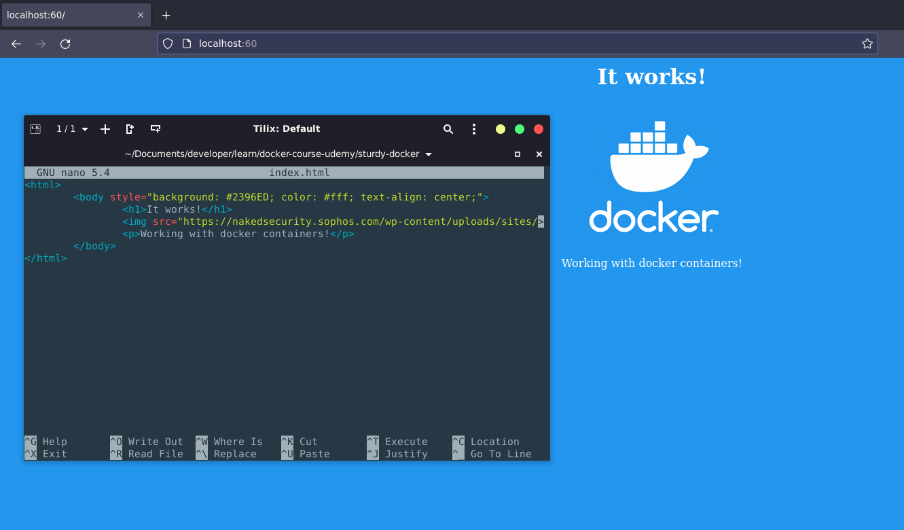
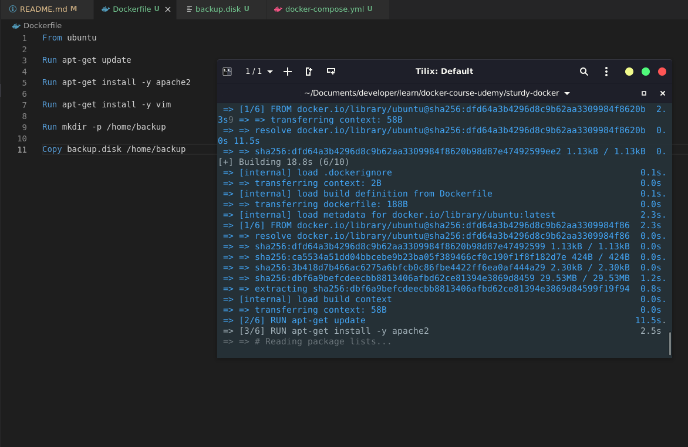

# sturdy-docker
Docker course by Ahmed Alkabary (Udemy)

Topics:

- Docker basics
- Installation
- Running a container
- Running an Apache container
- Running a MySQL container
- Running both containers with docker-compose
- Using a Dockerfile
- Using Docker volumes

---

